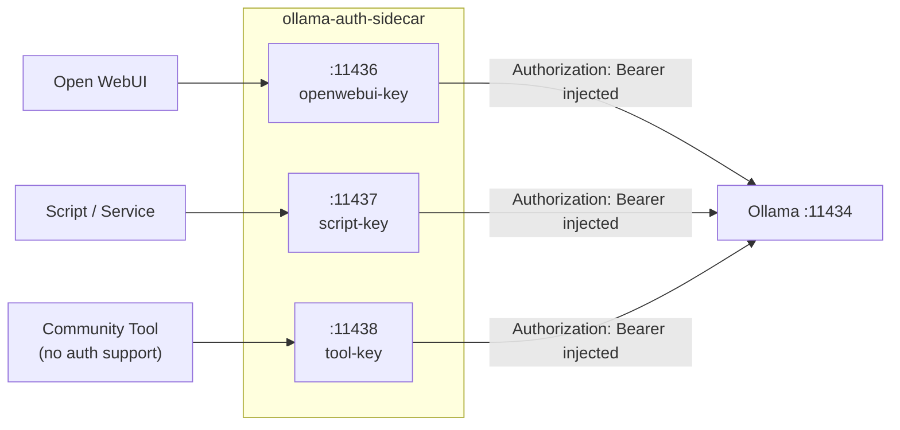

# ollama-auth-sidecar

Add per-client auth to your Ollama instance — no full reverse-proxy required.

## Why it exists

Ollama's native auth is a single server-wide key. Every client shares the same credential, there's no per-client attribution, and community tools that can't send `Authorization: Bearer` headers are locked out entirely.

The sidecar fixes this. Each consumer gets its own listen port and its own key. Clients that can't send auth headers point at the sidecar instead of Ollama directly — the sidecar injects the header for them.

It's a single nginx container with a small config file. No databases, no dashboards, no processes to keep alive.



## Quick start

```yaml
# docker-compose.yml
services:
  ollama:
    image: ollama/ollama:latest
    # ... your Ollama config

  ollama-auth-sidecar:
    image: ghcr.io/tadmstr/ollama-auth-sidecar:latest
    network_mode: host
    environment:
      NGINX_BIND: "127.0.0.1"
      OPENWEBUI_KEY: "${OPENWEBUI_KEY}"
    volumes:
      - ./config.yaml:/etc/ollama-auth-sidecar/config.yaml:ro
    cap_drop: [ALL]
    security_opt: ["no-new-privileges:true"]
    user: nginx
    read_only: true
    tmpfs:
      - /var/cache/nginx:uid=101,gid=101
      - /var/run:uid=101,gid=101
      - /tmp:uid=101,gid=101
```

```yaml
# config.yaml (never commit with literal keys — use ${ENV_VAR} references)
services:
  - name: openwebui
    listen: 11436
    upstream: http://host.docker.internal:11434
    timeout: 300s
    headers:
      Authorization: "Bearer ${OPENWEBUI_KEY}"
```

Point Open WebUI at `http://127.0.0.1:11436` instead of Ollama's `11434`. Done.

## Config reference

```yaml
services:
  - name: <string>          # unique identifier; becomes X-Client-Name header
    listen: <port>          # 1024–65535; clients connect here
    upstream: <url>         # http:// or https:// URL of the actual service
    timeout: <duration>     # e.g. 300s, 5m — applies to read and send timeouts
    headers:                # one or more headers to inject on every proxied request
      Header-Name: "value or ${ENV_VAR}"
```

**Config file location:** `/etc/ollama-auth-sidecar/config.yaml` (override with `CONFIG_PATH` env var).

**Header values** use `${UPPER_CASE_VAR}` references only. The sidecar fails fast at startup if any referenced variable is unset or empty — you won't discover a missing key at request time.

**Environment variables:**

| Variable | Default | Description |
|---|---|---|
| `CONFIG_PATH` | `/etc/ollama-auth-sidecar/config.yaml` | Path to config file |
| `NGINX_BIND` | `127.0.0.1` | Address nginx listens on |

## Deployment modes

### Mode A — host networking (recommended default)

The sidecar runs with `network_mode: host` and binds to `127.0.0.1`. Host processes (PM2 services, scripts) reach it at `http://127.0.0.1:<port>`. Containers on the same host can use `host.docker.internal:<port>`.

See [`compose.mode-a.yml`](compose.mode-a.yml) for the full example.

> **Security:** Keep `NGINX_BIND=127.0.0.1`. Changing it to `0.0.0.0` in host mode exposes your upstream credentials to any host that can reach those ports.

### Mode B — shared bridge network

The sidecar and consumer containers join a dedicated named Docker network. Consumers reach the sidecar by service name: `http://ollama-auth-sidecar:<port>`.

See [`compose.mode-b.yml`](compose.mode-b.yml) for the full example.

> **Security:** Only services that need the sidecar should join `ollama-auth-net`. Any container on the network can use the sidecar's ports and have upstream credentials injected.

## Works with any auth-gated endpoint

The `upstream` and `headers` config is generic — the sidecar isn't Ollama-locked. For a service that uses an API key header instead of Bearer:

```yaml
services:
  - name: custom-service
    listen: 11438
    upstream: http://internal-api:8080
    timeout: 30s
    headers:
      X-API-Key: "${CUSTOM_API_KEY}"
      X-Tenant-ID: "${TENANT_ID}"
```

## Key rotation runbook

1. Generate a new key and set the new value in your env or secrets manager.
2. Update the environment variable the sidecar uses (e.g. `OPENWEBUI_KEY`).
3. Restart the sidecar: `docker compose restart ollama-auth-sidecar`
4. Restart the consuming service so it picks up the new port/key path.

Container restart is under 1s. In-flight requests from the consumer side reconnect immediately after restart.

## When to upgrade to ollama-queue-proxy

Use [`ollama-queue-proxy`](https://github.com/TadMSTR/ollama-queue-proxy) instead if you need:

- **Priority queuing** — separate interactive and batch workloads
- **Failover** across multiple Ollama instances
- **Per-client Prometheus metrics** and webhook notifications

`ollama-queue-proxy` v0.2.0 ships with client key injection built in — if you need queuing and failover, you won't need both tools.

## Limitations

- No TLS termination — localhost/internal-network use only by default
- No retries or failover — single upstream per service
- Config changes require a container restart (< 1s)
- No per-service rate limiting

## Upstream compatibility

Tested against Ollama with `Authorization: Bearer <key>`. Any upstream that accepts an HTTP header you configure in `headers:` works — change the header name and value pattern in `config.yaml` for different auth schemes.

## Security

See [SECURITY.md](SECURITY.md) for the vulnerability reporting policy and the full trust model.

**Short version:** The sidecar's ports have no auth of their own. Keep `NGINX_BIND=127.0.0.1` (the default) or use a dedicated named Docker network. Never put literal keys in `config.yaml`.
